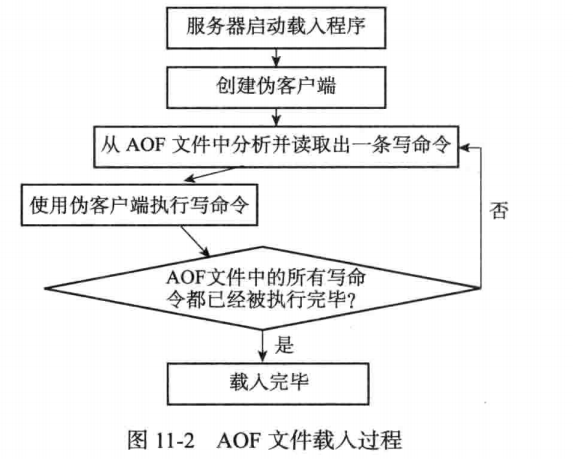
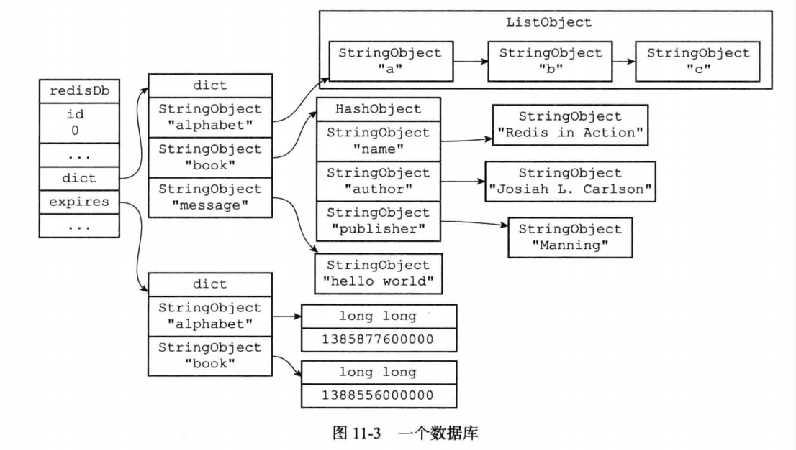
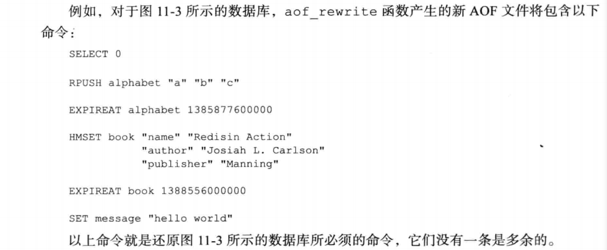
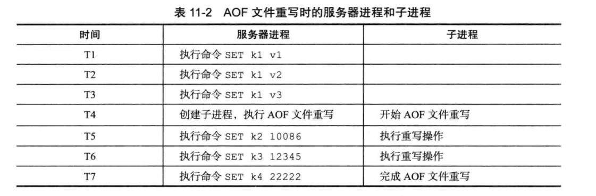
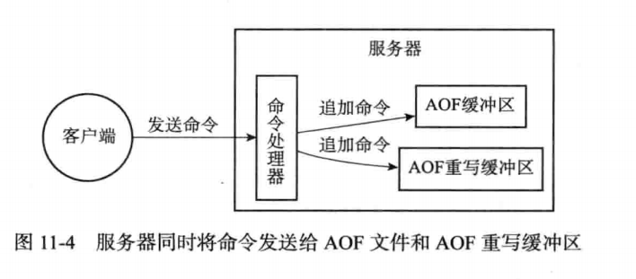
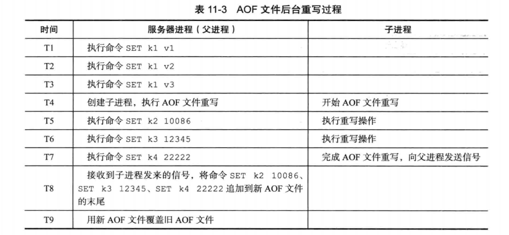

* 除了RDB持久化功能之外，Redis还提供了AOF(Append Only File)持久化功能。与RDB持久化通过保存数据库中的键值对来记录数据库状态不同，AOF持久化是通过保存Redis服务器所执行的写命令来记录数据库状态.
  
* 被写入AOF文件的所有命令都是以Redis的命令请求协议格式保存的，因为Redis的命令请求协议是纯文本格式，所以我们可以直接打开一个AOF文件，观察里面的内容。
* 服务器在启动时，可以通过载入和执行AOF文件中保存的命令来还原服务器关闭之前的数据库状态

#### AOF持久化的实现
* AOF持久化功能的实现可以分为命令追加(append)、文件写入、文件同步(sync)三 个步骤。

##### 命令追加
* 当AOF持久化功能处于打开状态时，服务器在执行完一个写命令之后，会以协议格式将被执行的写命令追加到服务器状态的aof_buf缓冲区的末尾:
  ```c
  struct redisServer {
      // ...
      // AOF缓冲区
      sds aof_buf;
      // ...
  }；
  ```
  
##### AOF文件的写入与同步
* Redis的服务器进程就是一个事件循环(loop),这个循环中的文件事件负责接收客户端的命令请求，以及向客户端发送命令回复，而时间事件则负责执行像serverCron函数这样需要定时运行的函数。
* 因为服务器在处理文件事件时可能会执行写命令，使得一些内容被追加到aof_buf缓冲区里面，所以在服务器每次结束一个事件循环之前，它都会调用flushAppendOnlyFile函数，
考虑是否需要将aof_buf缓冲区中的内容写入和保存到AOF文件里面，这个过程可以用以下伪代码表示:
  ```c
  def eventLoop():
      while True:
          #处理文件事件，接收命令请求以及发送命令回复
          #处理命令请求时可能会有新内容被追加到aof_buf缓冲区中  
          processFileEvents()
          #处理时间事件
          processTimeEvents()
          #考虑是否要将aof_buf中的内容写入和保存到AOF文件里面
          flushAppendOnlyFile()
  ```
* flushAppendOnlyFile函数的行为由服务器配置的appendfsync选项的值来决定，各个不同值产生的行为如表所示

  | appendfsync选项的值 | flushAppendOnlyFile 函数的行为                               |
  | ------------------- | ------------------------------------------------------------ |
  | always              | 将aof_buf缓冲区中的所有内容写入并同步到AOF文件               |
  | everysec            | 将aof_buf缓冲区中的所有内容写入到AOF文件，如果上次同步AOF文件的时间距离现在超过一秒钟，那么再次对AOF文件进行同步，并且这个同步操作是由一个线程专门负责执行的 |
  | no                  | 将aof_buf缓冲区中的所有内容写入到AOF文件，但并不对AOF文件进行同步，何时同步宙操作系统来决定 |
  * 如果用户没有主动为appendfsync选项设置值，那么appendfsync选项的默认值everysec。
* 文件的写入和同步
  * 为了提高文件的写入效率，在现代操作系统中，当用户调用write函数，将一些数据写入到文件的时候，操作系统通常会将写入数据暂时保存在一个内存缓冲区里面，等到緩冲区的空间被填满、或者超过了指定的时限之后，才真正地将缓冲区中的数据写入到磁盘里面。
    这种做法虽然提高了效率，但也为写入数据带来了安全问题，因为如果计算机发生停机，那么保存在内存缓冲区里面的写入数据将会丢失。
    为此，系统提供了fsync和fdatasync两个同步函数，它们可以强制让操作系统立即将缓冲区中的数据写入到硬盘里面，从而确保写入数据的安全性。
* AOF持久化的效率和安全性
  * 服务器配置appendfsync选项的值直接决定AOF持久化功能的效率和安全性。
  * 当appendfsync的值为always时，服务器在每个事件循环都要将aof_buf緩冲区中的所有内容写入到AOF文件，并且同步AOF文件，所以always的效率是appendfsync
  选项三个值当中最慢的一个，但从安全性来说，always也是最安全的，因为即使出现故障停机，AOF持久化也只会丢失一个事件循环中所产生的命令数令。
  * 当appendfsync的值为everysec时，服务器在每个事件循环都要将aof_buf缓冲区中的所有内容写入到AOF文件，并且每隔一秒就要在子线程中对AOF文件进行一次同歩。
  从效率上来讲，everysec模式足够快，并且就算出现故障停机，数据库也只丢失一秒钟的命令数据。
  * 当appendfsync的值为no时，服务器在每个事件循环都要将aof_buf缓冲区中的所有内容写入到AOF文件，至于何时对AOF文件进行同步，则由操作系统控制。
  因为处于no模式下的flushAppendOnlyFile调用无须执行同步操作，所以该模式下的AOF文件写入速度总是最快的，不过因为这种模式会在系统缓存中积累一段时间的写入数据，
  所以该模式的单次同步时长通常是三种模式中时间最长的。从平摊操作的角度来看，no模式和everysec模式的效率类似，当出现故障停机时，使用no模式的服务器将丢失上次同步AOF文件之后的所有写命令数据。

#### AOF文件的载入与数据还原
* 因为AOF文件里面包含了重建数据库状态所需的所有写命令，所以服务器只要读入并重新执行一遍AOF文件里面保存的写命令，就可以还原服务器关闭之前的数据库状态。
* Redis读取AOF文件并还原数据库状态的详细步骤如下:
  * 创建一个不带网络连接的伪客户端(fake client):因为Redis的命令只能在客户端上下文中执行，而载入AOF文件时所使用的命令直接来源于AOF文件而不是网络连接，
  所以服务器使用了一个没有网络连接的伪客户端来执行AOF文件保存的写命令，伪客户端执行命令的效果和带网络连接的客户端执行命令的效果完全一样。
  * 从AOF文件中分析并读取出一条写命令。
  * 使用伪客户端执行被读出的写命令。
  * 一直执行步骤2和步骤3,直到AOF文件中的所有写命令都被处理完毕为止。
* 当完成以上步骤之后，AOF文件所保存的数据库状态就会被完整地还原出来，整个过程如图所示
  

####  AOF 重写
* 因为AOF持久化是通过保存被执行的写命令来记录数据库状态的，所以随着服务器运行时间的流逝，AOF文件中的内容会越来越多，文件的体积也会越来越大，如果不加以控
制的话，体积过大的AOF文件很可能对Redis服务器、甚至整个宿主计算机造成影响，并且AOF文件的体积越大，使用AOF文件来进行数据还原所需的时间就越多。
* 为了解决AOF文件体积膨胀的问题，Redis提供了AOF文件重写(rewrite)功能。通过该功能，Redis服务器可以创建一个新的AOF文件来替代现有的AOF文件，新旧
两个AOF文件所保存的数据库状态相同，但新AOF文件不会包含任何浪费空间的冗余命令，所以新AOF文件的体积通常会比旧AOF文件的体积要小得多。

##### AOF文件重写的实现
* 虽然Redis将生成新AOF文件替换旧AOF文件的功能命名为“AOF文件重写”，但实际上，AOF文件重写并不需要对现有的AOF文件进行任何读取、分析或者写入操作，这个功能是通过读取服务器当前的数据库状态来实现的。
* 首先从数据库中读取键现在的值，然后用一条命令去记录键值对，代替之前记录这个键值对的多条命令，这就是AOF重写功能的实现原理。
* 整个重写过程可以用以下伪代码表示:
  ```
  def aof_rewrite(new_aof_file_name):
      #创建新AOF文件
      f = create_flie(new_aof_file_name)
      #遍历数据库 
      for db in redisServer.db:
          #忽略空数据库
          if db.is_empty(): continue
          #写入SELECT命令，指定数据库号码
          f.write_command("SELECT" + db.id)
          #遍历数据库中的所有键
          for key in db:
              #忽略已过期的键
              if key.is_expired(): continue
              #根据键的类型对键进行重写
              if key.type == String:
                rewrite_string(key) 
              elif key.type == List: 
                rewrite_list(key) 
              elif key.type == Hash:
                rewrite_hash(key) 
              elif key.type == Set: 
                rewrite_set(key) 
              elif key.type == SortedSet: 
                rewrite_sorted_set(key)
              #如果键带有过期时间，那么过期时间也要被重写
              if key.have_expire_time():
              rewrite_expire_time(key)
      #写入完毕，关闭文件
      f.close ()
      
  def rewrite_string(key):
      #使用GET命令获取字符串键的值
      value = GET(key)
      #使用SET命令重写字符串键
      f.write_command(SET, key, value)
  
  def rewrite_list(key):
      #使用LRANGE命令获取列表键包含的所有元素
      iteml, item2r itemN = LRANGE(key, 0, -1)
      #使用RPUSH命令重写列表键
      f.write_command(RPUSH, key, iteml, item2, ・..， itemN)
  
  def rewrite_hash(key):
      #使用HGETALL命令获取哈希键包含的所有键值对
      fieldl, valuel, field2, value2, ・•・,fieldN, valueN = HGETALL(key)
      #使用HMSET命令重写哈希键
      f.write_conunand(HMSET, key, fieldl, valuel, field2, value2, ..., fieldN, valueN)
      
  def rewrite_set(key);
      #使用SMEMBERS命令获取集合键包含的所有元素
      elemi, elem2, ..., elemN = SMEMBERS(key)
      #使用SAQQ命令重写集合键
      f.write_command(SADD, key, elemi, elem2,	elemN)
  
  def rewrite_sorted_set(key):
      #使用ZMNGE命令获取有序集合键包含的所有元素
      member1, score1, member2,score2, ...,memberN, scoreN = ZRANGE(key, 0, -1, "WITHSCORES")
      #使用ZAQD命令重写有序集合键
      f.write_command(ZADD, key, score1, member1, score2, member2, ... ,scoreN, memberN)
                                                             
  def rewrite_expire_time(key):
      #获取毫秒精度的键过期时间戳
      timestamp = get_expire_time_in_unixstamp(key)
      #使用PEXPTREAT命令重写键的过期时间
      f.write_command (PEXPIREAT, key, time st amp)
  ```

* 因为aof_rewrite函数生成的新AOF文件只包含还原当前数据库状态所必须的命令, 所以新AOF文件不会浪费任何硬盘空间。
  
  
* 注意, 在实际中，为了避免在执行命令时造成客户端输入缓冲区溢出，重写程序在处理列表、哈希表、集合、有序集合这四种可能会带有多个元素的键时，会先检查键
所包含的元素数量，如果元素的数量超过了 `redis.h/REDIS_AOF_REWRITE_ITEMS_PER_CMD` 常量的值，那么重写程序将使用多条命令来记录键的值，而不单单使用一条命令。
  * 在目前版本中，REDIS_AOF_REWRITE_ITEMS_PER_CMD常量的值为64,这也就是说，如果一个集合键包含了超过64个元素，那么重写程序会用多条SADD命令来记录这个集合，并且每条命令设置的元素数量也为64个:
    ```
    SADD <set-key> <eleml> <elem2> ... <elem64>
    SADD <set-key> <elem65> <elem66> ... <eleml28>
    SADD <set-key> <eleml29> <eleml30> ... <eleml92>
    ```
  * 另一方面如果一个列表键包含了超过64个项，那么重写程序会用多条RPUSH命令来保存这个列表，并且每条命令设置的项数量也为64个:
    ```
    RPUSH <list-key> <iteml> <item2> ... <item64>
    RPUSH <list-key> <item65> <item66> ... <iteml28>
    RPUSH <list-key> <item129> <item130> ... <item192>
    ```
  * 重写程序使用类似的方法处理包含多个元素的有序集合键，以及包含多个键值对的哈希表键。

##### AOF后台重写
* 上面介绍的AOF重写程序aof_rewrite函数可以很好地完成创建一个新AOF文件的任务，但是，因为这个函数会进行大量的写入操作，所以调用这个函数的线程将被长
时间阻塞, 因为Redis服务器使用单个线程来处理命令请求，所以如果由服务器直接调用aof_rewrite函数的话，那么在重写AOF文件期间，服务期将无法处理客户端发来的命令请求。
* 很明显，作为一种辅佐性的维护手段，Redis不希望AOF重写造成服务器无法处理请求，所以Redis决定将AOF重写程序放到子进程里执行，这样做可以同时达到两个目的:
  * 子进程进行AOF重写期间，服务器进程(父进程)可以继续处理命令请求。
  * 子进程带有服务器进程的数据副本，使用子进程而不是线程，可以在避免使用锁的情况下，保证数据的安全性。
* 不过，使用子进程也有一个问题需要解决，因为子进程在进行AOF重写期间，服务器进程还需要继续处理命令请求，而新的命令可能会对现有的数据库状态进行修改，从而使得服务器当前的数据库状态和重写后的AOF文件所保存的数据库状态不一致。
* 展示了一个AOF文件重写例子
  
  * 当子进程开始进行文件重写时，数据库中只有k1一个键，但是当子进程完成AOF文件重写之后，服务器进程的数据库中已经新设置了 k2、k3、k4三个键，因此，
  重写后的AOF文件和服务器当前的数据库状态并不一致, 新的AOF文件只保存了k1一个键的数据，而服务器数据库现在却有k1、k2、k3、k4四个键。
* 为了解决这种数据不一致问题，Redis服务器设置了一个AOF重写缓冲区，这个缓冲区在服务器创建子进程之后开始使用，当Redis服务器执行完一个写命令之后，它会同时将这个写命令发送给AOF缓冲区和AOF重写缓冲区
* 这也就是说，在子进程执行AOF重写期间，服务器进程需要执行以下三个工作:
  * 执行客户端发来的命令。
  * 将执行后的写命令追加到AOF缓冲区。
  * 将执行后的写命令追加到AOF重写缓冲区。
  
* 这样一来可以保证:
  * AOF缓冲区的内容会定期被写入和同步到AOF文件，对现有AOF文件的处理工作会如常进行。
  * 从创建子进程开始，服务器执行的所有写命令都会被记录到AOF重写缓冲区里面。
* 当子进程完成AOF重写工作之后，它会向父进程发送一个信号，父进程在接到该信号之后，会调用一个信号处理函数，并执行以下工作:
  * 将AOF重写缓冲区中的所有内容写入到新AOF文件中，这时新AOF文件所保存的数据库状态将和服务器当前的数据库状态一致。
  * 对新的AOF文件进行改名，原子地(atomic)覆盖现有的AOF文件，完成新旧两个AOF文件的替换。
  * 这个信号处理函数执行完毕之后，父进程就可以继续像往常一样接受命令请求了。
* 在整个AOF后台重写过程中，只有信号处理函数执行时会对服务器进程(父进程)造成阻塞，在其他时候，AOF后台重写都不会阻塞父进程，这将AOF重写对服务器性能造成的影响降到了最低。
* 展示了一个AOF文件后台重写的执行过程:
  

#### 重点回顾
* AOF文件通过保存所有修改数据库的写命令请求来记录服务器的数据库状态。
* AOF文件中的所有命令都以Redis命令请求协议的格式保存。
* 命令请求会先保存到AOF缓冲区里面，之后再定期写入并同步到AOF文件。
* appendfsync选项的不同值对AOF持久化功能的安全性以及Redis服务器的性能有很大的影响。
* 服务器只要载入并重新执行保存在AOF文件中的命令，就可以还原数据库本来的状态。
* AOF重写可以产生一个新的AOF文件，这个新的AOF文件和原有的AOF文件所保存的数据库状态一样，但体积更小。
* AOF重写是一个有歧义的名字，该功能是通过读取数据库中的键值对来实现的，程序无须对现有AOF文件进行任何读入、分析或者写入操作。
* 在执行BGREWRITEAOF命令时，Redis服务器会维护一个AOF重写缓冲区，该缓冲区会在子进程创建新AOF文件期间，记录服务器执行的所有写命令。当子进程完成
创建新AOF文件的工作之后，服务器会将重写缓冲区中的所有内容追加到新AOF文件的末尾，使得新旧两个AOF文件所保存的数据库状态一致。最后，服务器用新的AOF文件替换旧的AOF文件，以此来完成AOF文件重写操作。
