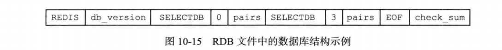
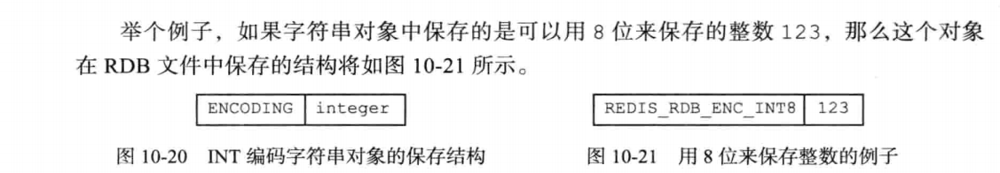
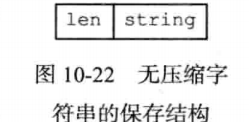

* Redis是一个键值对数据库服务器，服务器中通常包含着任意个非空数据库，而每个非空数据库中又可以包含任意个键值对，为了方便起见，我们将服务器中的非空数据库以及它们的键值对统称为数据库状态。
* 因为Redis是内存数据库，它将自己的数据库状态储存在内存里面，所以如果不想办法将储存在内存中的数据库状态保存到磁盘里面，那么一旦服务器进程退出，服务器中的数据库状态也会消失不见。
* 为了解决这个问题，Redis提供了RDB持久化功能，这个功能可以将Redis在内存中的数据库状态保存到磁盘里面，避免数据意外丢失。
* RDB持久化既可以手动执行，也可以根据服务器配置选项定期执行，该功能可以将某个时间点上的数据库状态保存到一个RDB文件中。
* RDB持久化功能所生成的RDB文件是一个经过压缩的二进制文件，通过该文件可以还原生成RDB文件时的数据库状态。
* 因为RDB文件是保存在硬盘里面的，所以即使Redis服务器进程退出，甚至运行Redis服务器的计算机停机，但只要RDB文件仍然存在，Redis服务器就可以用它来还原数据库状态。

#### RDB文件的创建与载入
* 有两个Redis命令可以用于生成RDB文件，一个是SAVE,另一个是BGSAVE. SAVE命令会阻塞Redis服务器进程，直到RDB文件创建完毕为止，在服务器进程阻塞期间，服务器不能处理任何命令请求:
* 和SAVE命令直接阻塞服务器进程的做法不同，BGSAVE命令会派生出一个子进程，然后由子进程负责创建RDB文件，服务器进程(父进程)继续处理命令请求:
* 创建RDB文件的实际工作由 `rdb.c/rdbSave` 函数完成，SAVE命令和BGSAVE命令会以不同的方式调用这个函数，通过以下伪代码可以明显地看出这两个命令之间的区别:
  ```c
  def SAVE ():
    #创建#庞文件
    rdbSave()
  def BGSAVE():
    #创建子进程
    pid = fork()
    if pid == 0:
      #子进程负责创建択如文件
      rdbSave()
      #完成之后向父进程发送信号
      signal_parent()
    elif pid > 0:
      #父进程继续处理命令请求，并通过轮询等待子进程的信号 handle_request_and_wait_signal()
  	else:
      #处理出错情况
      handle_fork_error()
  ```
* 和使用SAVE命令或者BGSAVE命令创建RDB文件不同，RDB文件的载入工作是在服务器启动时自动执行的，所以Redis并没有专门用于载入RDB文件的命令，只要Redis服务器在启动时检测到RDB文件存在，它就会自动载入RDB件。
* 另外值得一提的是，因为AOF文件的更新频率通常比RDB文件的更新频率高，所以: 
  * 如果服务器开启了AOF持久化功能，那么服务器会优先使用AOF文件来还原数据库状态。
  * 只有在AOF持久化功能处于关闭状态时，服务器才会使用RDB文件来还原数据库状态。 
* 载入RDB文件的实际工作由 `rdb.c/rdbLoad` 函数完成

##### SAVE命令执行时的服务器状态
* 前面提到过，当SAVE命令执行时，Redis服务器会被阻塞，所以当SAVE命令正在执行时，客户端发送的所有命令请求都会被拒绝。
* 只有在服务器执行完SAVE命令、重新开始接受命令请求之后，客户端发送的命令才会被处理。

##### BGSAVE命令执行时的服务器状态
* 因为BGSAVE命令的保存工作是由子进程执行的，所以在子进程创建RDB文件的过程中，Redis服务器仍然可以继续处理客户端的命令请求，但是，在BGSAVE命令执行期间， 服务器处理SAVE、BGSAVE、BGREWRITEAOF三个命令的方式会和平时有所不同。
  * 首先，在BGSAVE命令执行期间，客户端发送的SAVE命令会被服务器拒绝，服务器禁止SAVE命令和BGSAVE命令同时执行是为了避免父进程(服务器进程)和子进程同时执行两个rdbSave调用，防止产生竞争条件。
  * 其次，在BGSAVE命令执行期间，客户端发送的BGSAVE命令会被服务器拒绝，因为同时执行两个BGSAVE命令也会产生竞争条件。
  * 最后，BGREWRITEAOF和BGSAVE两个命令不能同时执行:
    * 如果BGSAVE命令正在执行，那么客户端发送的BGREWRITEAOF命令会被延迟到BGSAVE命令执行完毕之后执行。
    * 如果BGREWRITEAOF命令正在执行，那么客户端发送的BGSAVE命令会被服务器拒绝。
  * 因为BGREWRITEAOF和两个命令的实际工作都由子进程执行，所以这两个命令在操作方面并没有什么冲突的地方，不能同时执行它们只是一个性能方面的考虑——并发出两个子进程，并且这两个子进程都同时执行大量的磁盘写入操作，这怎么想都不会是一个好主意。

##### RDB文件载入时的服务器状态
* 服务器在载入RDB文件期间，会一直处于阻塞状态，直到载入工作完成为止。

#### 自动间隔性保存
* SAVE命令和BGSAVE命令在实现方面的主要区别:
  * SAVE命令由服务器进程执行保存工作，BGSAVE命令则由子进程执行保存工作，所以吓命令会阻塞服务器，而BGSAVE则不会。
  * 因为BGSAVE命令可以在不阻塞服务器进程的情况下执行，所以Redis允许用户通过设置服务器配置的save选项，让服务器每隔一段时间自动执行一次BGSAVE命令。
  * 用户可以通过save选项设置多个保存条件，但只要其中任意一个条件被满足，服务器就会执行BGSAVE命令。
* 举个例子，如果我们向服务器提供以下配置:
  ```
  save 900 1        #服务器在900秒之内，对数据库进行了至少1次修改。
  save 300 10       #服务器在300秒之内，对数据库进行了至少10次修改。
  save 60 10000     #服务器在60秒之内，对数据库进行了至少10000次修改。
  ```
  那么只要满足以下三个条件中的任意一个，BGSSm命令就会被执行:

##### 设置保存条件
* 当Redis服务器启动时，用户可以通过指定配置文件或者传入启动参数的方式设置save选项，如果用户没有主动设置save选项，那么服务器会为save选项设置默认条件:
  ```
  save 900 1
  save 300 10
  save 60 10000
  ```
  接着，服务器程序会根据save选项所设置的保存条件，设置服务器状态redisServer结构的saveparams属性:

  ```c
  struct redisServer{
    //记录了保存条件的数组 
    struct saveparam *saveparams;
    //
  };
  ```
  saveparams属性是一个数组，数组中的每个元素都是一个saveparam结构，每个saveparam结构都保存了一个save选项设置的保存条件:
  ```c
  struct saveparam{
    //秒数
    seconds;
    //修改数
    int changes;
  };
  ```

##### dirty 计数器和 lastsave 属性
* 除了saveparams数组之外，服务器状态还维持着一个dirty计数器，以及一个lastsave属性:
* dirty计数器记录距离上一次成功执行SAVE命令或者BGSAVE命令之后，服务器对数据库状态(服务器中的所有数据库)进行了多少次修改(包括写入、删除、更新等操作)
* lastsave属性是一个UNIX时间戳，记录了服务器上一次成功执行SAVE命令或者BGSAVE命令的时间。

  ```c
  struct redisServer{
    //修改计数器 
    long long dirty;
    //上一次执行保存的时间 
    time_t lastsave; 
  };
  ```
  当服务器成功执行一个数据库修改命令之后，程序就会对dirty计数器进行更新:命令修改了多少次数据库，dirty计数器的值就增加多少。

##### 检查保存条件是否满足
* Redis的服务器周期性操作函数serverCron默认每隔100毫秒就会执行一次，该函数用于对正在运行的服务器进行维护，它的其中一项工作就是检查save选项所设置的保存条件是否已经满足，如果满足的话，就执行BGSAVE命令。
* 以下伪代码展示了 serverCron 函数检査保存条件的过程:
  ```c
  def serverCron ():
      # ...
      #遍历所有保存条件
      for saveparam in server.saveparams:
          #计算距离上次执行保存操作有多少秒 
          save_interval = unixtime_now() - server.lastsave
          #如果数据库状态的修改次数超过条件所设置的次数
          #并且距离上次保存的时间超过条件所设置的时间
          #那么执行保存操作 
          if server.dirty >= saveparam.changes and save_interval > saveparam.seconds:
              BGSAVE()
  ```
  程序会遍历并检查saveparams数组中的所有保存条件，只要有任意一个条件被满足, 那么服务器就会执行BGSAVE命令。

#### RDB文件结构
* 一个完整RDB文件所包含的各个部分
  
  * 为了方便区分变量、数据、常量，图中用全大写单词标示常量，用全小写单词标示变量和数据。
* RDB文件的最开头是REDIS部分，这个部分的长度为5字节，保存着"REDIS"五个字符。通过这五个字符，程序可以在载入文件时，快速检査所载入的文件是否RDB文件。
* 因为RDB文件保存的是二进制数据，而不是C字符串，为了简便起见，我们用"REDIS"符号代表'R','E','D','I','S'五个字符，而不是带，\ 0，结尾符号的C字符串'R','E','D','I','S','\0' 
* db_version长度为4字节，它的值是一个字符串表示的整数，这个整数记录了 RDB 文件的版本号，比如"0006"就代表RDB文件的版本为第六版。
* databases部分包含着零个或任意多个数据库，以及各个数据库中的键值对数据:
  * 如果服务器的数据库状态为空(所有数据库都是空的)，那么这个部分也为空，长度为0字节。
  * 如果服务器的数据库状态为非空(有至少一个数据库非空)，那么这个部分也为非空，根据数据库所保存键值对的数量、类型和内容不同，这个部分的长度也会有所不同。
* EOF常量的长度为1字节，这个常量标志着RDB文件正文内容的结束，当读入程序遇到这个值的时候，它知道所有数据库的所有键值对都已经载入完毕了。
* checksum是一个8字节长的无符号整数，保存着一个校验和，这个校验和是程序通过对REDIS、db_version、databases、EOF四个部分的内容进行计算得出的。
服务器在载入RDB文件时，会将载人数据所计算出的校验和与check_sum所记录的校验和进行对比，以此来检查RDB文件是否有出错或者损坏的情况出现。
  

##### databases 部分
* 一个RDB文件的databases部分可以保存任意多个非空数据库。
* 例如，如果服务器的0号数据库和3号数据库非空，那么服务器将创建一个如图所示的RDB文件，图中的database 0代表0号数据库中的所有键值对数据，而 database 3则代表3号数据库中的所有键值对数据。
  
* 每个非空数据库在RDB文件中都可以保存为SELECTDB、db_number , key_value_pairs三个部分，如图所示。
  
* SELECTDB常量的长度为1字节，当读入程序遇到这个值的时候，它知道接下来要读入的将是一个数据库号码。
* db_number保存着一个数据库号码，根据号码的大小不同，这个部分的长度可以是1字节、2字节或者5字节。当程序读入db_number部分之后，服务器会调用SELECT命令，根据读入的数据库号码进行数据库切换，之后读入的键值对可以载入到正确的数据库中。
* key_value_pairs部分保存了数据库中的所有键值对数据，如果键值对带有过期时间，那么过期时间也会和键值对保存在一起。根据键值对的数量、类型、内容以及是否有过期时间等条件的不同，key_value_pairs部分的长度也会有所不同。
* 展示了一个完整的RDB文件，文 件中包含了 0号数据库和3号数据库
  

###### key__value_pairs 部分
* RDB文件中的每个key_value_pairs部分都保存了一个或以上数量的键值对，如果键值对带有过期时间的话，甌么键值寿的过期时间也会被保存在内。
* 不带过期时间的键值对在RDB文件中由type、key、value三部分组成
* TYPE记录了 value的类型，长度为1字节，值可以是以下常量的其中一个:
  ```c
  REDIS_RDB_TYPE_STRING
  REDIS_RDB_TYPE_LIST
  REDIS_RDB_TYPE_SET
  REDIS_RDB_TYPE_ZSET
  REDIS_RDB_TYPE_HASH
  REDIS_RDB_TYPE_LIST_ZIPLIST
  REDIS_RDB_TYPE_SET_INTSET
  REDIS_RDB_TYPE_ZSET_ZIPLIST
  REDIS_RDB_TYPE_HASH_ZIPLIST
  ```
  * 以上列岀的每个TYPE常量皆代表了一种对象类型或者底层编码，当服务器读入RDB文件中的键值对数据时，程序会根据TYPE的值来决定如何读入和解释value的数据。 
* key和value分别保存了键值对的键对象和值对象
  * 其中key总是一个字符串对象，它的编码方式和REDIS_RDB_TYPE_STRING类型的value ―样。根据内容长度的不同，key的长度也会有所不同。
  * 根据TYPE类型的不同，以及保存内容长度的不同，保存value的结构和长度也会有所不同
* 带有过期时间的键值对在RDB文件中的结构如图所示
  
* 带有过期时间的键值对中的TYPE、key、value三个部分的意义，和前面介绍的 不带过期时间的键值对的TYPE、key、value三个部分的意义完全相同，至于新增的 EXPIRETIME_MS和ms,它们的意义如下:
  * EXPIRETIME_MS常量的长度为1字节，它告知读入程序，接下来要读入的将是一 个以毫秒为单位的过期时间。
  * ms是一个8字节长的带符号整数，记录着一个以毫秒为单位的UNIX时间戳，这个 时间戳就是键值对的过期时间。
    
    
##### value 的编码
* RDB文件中的每个value部分都保存了一个值对象.每个值对象的类型都由与之对应的TYPE记录，根据类型的不同，value部分的结构、长度也会有所不同。

###### 字符串对象
* 如果TYPE的值为REDIS_RDB_TYPE_STRING,那么value保存的就是一个字符串对象，字符串对象的编码可以是REDIS_ENCODING_INT或者REDIS_ENCODING_RAW
* 如果字符串对象的编码为REDIS_ENCODING_INT,那么说明对象中保存的是长度不超过32位的整数，这种编码的对象将以下图所示的结构保存。其中，ENCODING 的值可以是 REDIS_RDB_ENC_INT8、REDIS_RDB_ENC_INT16 或者REDIS_RDB_ENC_INT32三个常量的其中一个，它们分别代表RDB文件使用8位 (bit)、16位或者32位来保存整数值integer
  
* 如果字符串对象的编码为REDIS_ENCODING_RAW,那么说明对象所保存的是一个字符串值，根据字符串长度的不同，有压缩和不压缩两种方法来保存这个字符串:
  * 如果字符串的长度小于等于20字节，那么这个字符串会直接被原样保存
  * 如果字符串的长度大于20字节，那么这个字符串会被压缩之后再保存。
  * 注意，以上两个条件是在假设服务器打开了RDB文件压缩功能的情况下进行的，如果服务器关闭了RDB文件压缩功能，那么RDB程序总以无压缩的方式保存字符串值。具体信息可以参考redis.conf文件中关于rdbcompression选项的说明。
* 对于没有被压缩的字符串，RDB程序会以下图所示的结构来 保存该字符串。
  
  其中，string部分保存了字符串值本身，而len保存了字符串值的长度。
* 对于压缩后的字符串，RDB程序会以图所示的结构来保存该字符串
  
  其中，REDIS_RDB_ENC_LZF常量标志着字符串已经被LZF算法压缩过了，读入程序在碰到这个常量时，会根据之后的compressed_len, origin_len和compressed_string三部分，
  对字符串进行解压缩:其中compressed_len记录的是字符串被压缩之后的长度，而origin_len记录的是字符串原来的长度，compressed_string记录的则是被压缩之后的字符串。

###### 列表对象
* 如果 TYPE 的值为 REDIS_RDB_TYPE_LIST,那么 value 保存的就是REDIS_ENCODING_LINKEDLIST编码的列表对象，RDB文件保存这种对象的结构如图所示。
  
  list_length记录了列表的长度，它记录列表保存了多少个项(item),读入程序可以通过这个长度知道自己应该读入多少个列表项。图中以item开头的部分代表列表的项，因为每个列表项都是一个字符串对象，所以程序会以处理字符串对象的方式来保存和读入列表项。

###### 集合对象
* 如果TYPE的值为REDIS_RDB_TYPE_SET,那么value保存的就是一个REDIS_ENCODING_HT编码的集合对象，RDB文件保存这种对象的结构如图所示
  
  其中，set_size是集合的大小，它记录集合保存了多少个元素，读入程序可以通过这个大小知道自己应该读入多少个集合元素。图中以elem开头的部分代表集合的元素，因为每个集合元素都是一个字符串对象，所以程序会以处理字符串对象的方式来保存和读入集合元素。

###### 哈希表对象
* 如果TYPE的值为REDIS_RDB_TYPE_HASH,那么value保存的就是一个REDIS_ENCODING_HT编码的集合对象，RDB文件保存这种对象的结构如图所示:
  
  * hash_size记录了哈希表的大小，也即是这个哈希表保存了多少键值对，读入程序 可以通过这个大小知道自己应该读入多少个键值对。
  * 以key_value_pair开头的部分代表哈希表中的键值对，键值对的键和值都是字 符串对象，所以程序会以处理字符串对象的方式来保存和读入键值对
* 结构中的每个键值对都以键紧挨着值的方式排列在一起，如图所示。
  
* 因此，从更详细的角度看，结构可以进一步修改为
  

###### 有序集合对象
* 如果TYPE的值为REDIS_RDB_TYPE_ZSET,那么value保存的就是一个REDIS_ENCODING_SKIPLIST编码的有序集合对象，RDB文件保存这种对象的结构如图所示
  
  * sorted_set_size记录了有序集合的大小，也即是这个有序集合保存了多少元素，读入程序需要根据这个值来决定应该读入多少有序集合元素。
  * 以element开头的部分代表有序集合中的元素，每个元素又分为成员(member)和分 值(score)两部分，成员是一个字符串对象，分值则是一个double类型的浮点数，
  程序在保存RDB文件时会先将分值转换成字符串对象，然后再用保存字符串对象的方法将分值保存起来。
* 有序集合中的每个元素都以成员紧挨着分值的方式排列
    
* 因此，从更详细的角度看
    

###### INTSET编码的集合
* 如果TYPE的值为REDIS_RDB_TYPE_SET_INTSET,那么value保存的就是整数集合对象，RDB文件保存这种对象的方法是，先将整数集合转换为字符串对象，然后将这个字符串对象保存到RDB文件里面。
* 如果程序在读入RDB文件的过程中，碰到由整数集合对象转换成的字符串对象，那么程序会根据TYPE值的指示，先读入字符串对象，再将这个字符串对象转换成原来的整数集合对象。

###### ZIPLIST编码的列表、哈希表或者有序集合
* 如果 TYPE 的值为 REDIS_RDB_TYPE_LIST_ZIPLIST、REDIS_RDB_TYPE_HASH_ZIPLIST 或者 REDIS_RDB_TYPE_ZSET_ZIPLIST,那么 value 保存的就是一个压缩列表对象，RDB文件保存这种对象的方法是:
  * 将压缩列表转换成一个字符串对象。
  * 将转换所得的字符串对象保存到RDB文件。
* 如果程序在读入RDB文件的过程中，碰到由压缩列表对象转换成的字符串对象，那么程序会根据TYPE值的指示，执行以下操作:
  * 读入字符串对象，并将它转换成原来的压缩列表对象。
  * 根据TYPE的值，设置压缩列表对象的类型:如果TYPE的值为REDIS_RDB_TYPE_LIST_ZIPLIST,那么压缩列表对象的类型为列表；如果TYPE的值为
  REDIS_RDB_TYPE_HASH_ZIPLIST,那么压缩列表对象的类型为哈希表；如果TYPE的值为REDIS_RDB_TYPE_ZSET_ZIPLIST,那么压缩列表对象的类型为有序集合。
* 从步骤2可以看出，由于TYPE的存在，即使列表、哈希表和有序集合三种类型都使用压缩列表来保存，RDB读入程序也总可以将读入并转换之后得出的压缩列表设置成原来的类型。

#### 分析RDB文件
* 我们使用od命令来分析Redis服务器产生的RDB文件，该命令可以用给定的格式转存(dump)并打印输入文件。比如说，给定-c参数可以以ASCII编码的方式打印输入文件， 给定-X参数可以以十六进制的方式打印输入文件，诸如此类。

##### 不包含任何键值对的RDB文件

##### 包含字符串键的RDB文件

##### 关于分析RDB文件的说明

* 因为Redis本身带有RDB文件检査工具redis-check-dump,网上也能找到很多处理RDB文件的工具，所以人工分析RDB文件的内容并不是学习Redis所必须掌握的技能。
* 不过从学习RDB文件的角度来看，人工分析RDB文件是一个不错的练习，这种练习可以帮助我们熟悉RDB文件的结构和格式。
* 但是，对于RDB文件中的数字值，比如校验和来说，通过ASCII编码来打印它并不容易看出它的真实值，更好的办法是使用-ex参数调用od命令，同时以ASCII编码和十六进制格式打印RDB文件

#### 重点回顾
* RDB文件用于保存和还原Redis服务器所有数据库中的所有键值对数据。
* SAVE命令由服务器进程直接执行保存操作，所以该命令会阻塞服务器。
* BGSAVE令由子进程执行保存操作，所以该命令不会阻塞服务器。
* 服务器状态中会保存所有用save选项设置的保存条件，当任意一个保存条件被满足时，服务器会自动执行BGSAVE命令。
* RDB文件是一个经过压缩的二进制文件，由多个部分组成。
* 对于不同类型的键值对，RDB文件会使用不同的方式来保存它们。
