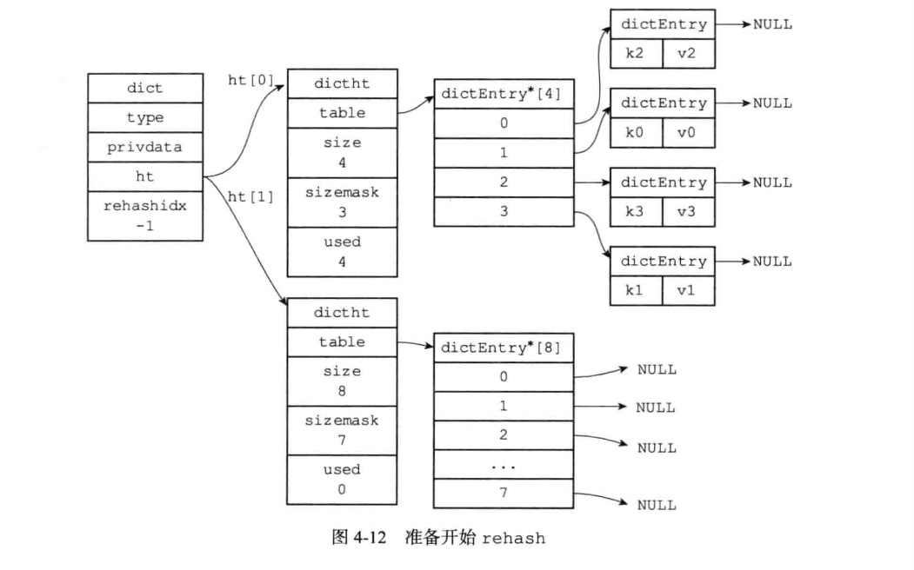

* 我们陆续介绍了Redis用到的所有主要数据结构，比如简单动态字符串(SDS)、双端链表、字典、压缩列表、整数集合等等。
* Redis并没有直接使用这些数据结构来实现键值对数据库，而是基于这些数据结构创建了一个对象系统，这个系统包含字符串对象、列表对象、哈希对象、集合对象和有序集合对象这五种类型的对象，每种对象都用到了至少一种我们前面所介绍的数据结构。
* 通过这五种不同类型的对象，Redis可以在执行命令之前，根据对象的类型来判断一个对象是否可以执行给定的命令。使用对象的另一个好处是，我们可以针对不同的使用场景， 为对象设置多种不同的数据结构实现，从而优化对象在不同场景下的使用效率。
* 除此之外，Redis的对象系统还实现了基于引用计数技术的内存回收机制，当程序不再使用某个对象的时候，这个对象所占用的内存就会被自动释放；另外，Redis还通过引用计数技术实现了对象共享机制，这一机制可以在适当的条件下，通过让多个数据库键共享同一个对象来节约内存。
* 最后，Redis的对象带有访问时间记录信息，该信息可以用于计算数据库键的空转时长，在服务器启用了maxmemory功能的情况下，空转时长较大的那些键可能会优先被服务器删除。

#### 对象的类型与编码
* Redis使用对象来表示数据库中的键和值，每次当我们在Redis的数据库中新创建一个键值对时，我们至少会创建两个对象，一个对象用作键值对的键(键对象),另一个对象用作键值对的值(值对象).
* 举个例子，以下SET命令在数据库中创建了一个新的键值对，其中键值对的键是一个包含了字符串值"msg"的对象，而键值对的值则是一个包含了字符串值"hello world" 的对象:`SET msg "hello world`
* Redis中的每个对象都由一个redisObject结构表示，该结构中和保存数据有关的三个属性分别是type属性、encoding属性和ptr属性:
  ```c
  typedef struct redisObject (
    //类型
    unsigned type:4;
    //编码
    unsigned encoding:4;
    //指向底层实现数据结构的指针
    void *ptr;
  } robj;
  ```

##### 类型
* 对象的type属性记录了对象的类型，这个属性的值可以是下表列出的常量的其中一个。

  | 类型常量     | 对象的名称   |
  | ------------ | ------------ |
  | REDIS_STRING | 字符串对象   |
  | REDIS_LIST   | 列表对象     |
  | REDIS_HASH   | 哈希对象     |
  | REDIS_SET    | 集合对象     |
  | REDIS_ZSET   | 有序集合对象 |
  
* 对于Redis数据库保存的键值对来说，键总是一个字符串对象，而值则可以是字符串对象、列表对象、哈希对象、集合对象或者有序集合对象的其中一种，因此:
  * 当我们称呼一个数据库键为“字符串键”时， 我们指的是“这个数据库键所对应的值为字符串对象”；
  * 当我们称呼一个键为“列表键”时，我们指的是“这个数据库键所对应的值为列表对象”。
* TYPE 命令的实现方式也与此类似，当我们对一个数据库键执行 TYPE 命令时，命令返回的结果为数据库键对应的值对象的类型，而不是键对象的类型.
* 不同类型值对象的 TYPE 命令输出

  | 对象         | 对象type属性的值 | TYPE命令的输出 |
  | ------------ | ---------------- | -------------- |
  | 字符串对象   | REDIS_STRING     | string         |
  | 列表对象     | REDIS_LIST       | list           |
  | 哈希对象     | REDIS_HASH       | hash           |
  | 集合对象     | REDIS_SET        | set            |
  | 有序集合对象  | REDIS_ZSET        | zset           |

##### 编码和底层实现
* 对象的ptr指针指向对象的底层实现数据结构，而这些数据结构由对象的encoding属性决定。
* encoding属性记录了对象所使用的编码，也即是说这个对象使用了什么数据结构作为对象的底层实现。
* 对象的编码

  | 编码常量                  | 编码所对应的底层数据结构   |
  | ------------------------- | -------------------------- |
  | REDIS_ENCODING_INT        | long类型的整数               |
  | REDIS_ENCODING_EMBSTR     | embstr编码的简单动态字符串     |
  | REDIS_ENCODING_RAW        | 简单动态字符串                |
  | REDIS_ENCODING_HT         | 字典                        |
  | REDIS_ENCODING_LINKEDLIST | 双端链表                     |
  | REDIS_ENCODING_ZIPLIST    | 压缩列表                     |
  | REDIS_ENCODING_INTSET     | 整数集合                     |
  | REDIS_ENCODING_SKIPLIST   | 跳跃表和字典                  |
* 每种类型的对象都至少使用了两种不同的编码
* 不同类型和编码的对象

  | 类型         | 编码                      | 对象                                           |
  | ------------ | ------------------------- | ---------------------------------------------- |
  | REDIS_STRING | REDIS_ENCODING_INT        | 使用整数值实现的字符串对象                        |
  | REDIS_STRING | REDIS_ENCODING_EMBSTR     | 使用embstr编码的简单动态字符串实现的字符串对象       |
  | REDIS_STRING | REDIS_ENCODING_RAW        | 使用简单动态字符串实现的字符串对象             |
  | REDIS_LIST   | REDIS_ENCODING_ZIPLIST    | 使用压缩列表实现的列表对象                     |
  | REDIS_LIST   | REDIS_ENCODING_LINKEDLIST | 使用双端链表实现的列表对象                     |
  | REDIS_HASH   | REDIS_ENCODING_ZIPLIST    | 使用压缩列表实现的哈希对象                     |
  | REDIS_HASH   | REDIS_ENCODING_HT         | 使用字典实现的哈希对象                         |
  | REDIS_SET    | REDIS_ENCODING_INTSET     | 使用整数集合实现的集合对象                     |
  | REDIS_SET    | REDIS_ENCODING_HT         | 使用字典实现的集合对象                         |
  | REDIS_ZSET   | REDIS_ENCODING_ZIPLIST    | 使用压缩列表实现的有序集合对象                 |
  | REDIS_ZSET   | REDIS_ENCODING SKIPLIST   | 使用跳跃表和字典实现的有序集合对象             |

* 使用 OBJECT ENCODING 命令可以查看一个数据库键的值对象的编码
* OBJECT ENCODING 对不同编码的输出

  | 对象所使用的底层数据结构        | 编码常量                  | OBJECT ENCODING 命令輸出 |
  | ------------------------------- | ------------------------- | ------------------------ |
  | 整数                            | REDIS_ENCODING_INT        | int                      |
  | embstr编码的简单动态字符串(SDS) | REDIS_ENCODING_EMBSTR     | embstr                   |
  | 简单动态字符串                  | REDIS ENCODING RAW        | raw                      |
  | 字典                            | REDIS ENCODING HT         | hashtable                |
  | 双端链表                        | REDIS_ENCODING_LINKEDLIST | linkedlist               |
  | 压缩列表                        | REDIS_ENCODING_ZIPLIST    | ziplist                  |
  | 整数集合                        | REDIS_ENCODING_INTSET     | intset                   |
  | 跳跃表和字典                    | REDIS_ENCODING_SKIPLIST   | skiplist                 |
* 通过encoding属性来设定对象所使用的编码，而不是为特定类型的对象关联一种固定的编码，极大地提升了Redis的灵活性和效率，因为Redis可以根据不同的使用场景来为一个对象设置不同的编码，从而优化对象在某一场景下的效率。
* 举个例子，在列表对象包含的元素比较少时，Redis使用压缩列表作为列表对象的底层实现:
  * 因为压缩列表比双端链表更节约内存，并且在元素数量较少时，在内存中以连续块方式保存的压缩列表比起双端链表可以更快被载入到缓存中；
  * 随着列表对象包含的元素越来越多，使用压缩列表来保存元素的优势逐渐消失时，对象就会将底层实现从压缩列表转向功能更强、也更适合保存大量元素的双端链表上面；其他类型的对象也会通过使用多种不同的编码来进行类似的优化。
  * 在接下来的内容中，我们将分别介绍Redis中的五种不同类型的对象，说明这些对象底层所使用的编码方式，列出对象从一种编码转换成另一种编码所需的条件，以及同一个命令在多种不同编码上的实现方法。

#### 字符串对象
* 字符串对象的编码可以是int、raw或者embstr
* 如果一个字符串对象保存的是整数值，并且这个整数值可以用long类型来表示，那么字符串对象会将整数值保存在字符串对象结构的ptr属性里面(将void*转换成long), 并将字符串对象的编码设置为int
* 举个例子，如果我们执行以下SET命令，那么服务器将创建一个in t编码的字符串对象作为 number键的值:
  ```
  redis> SET number 10086
  OK
  redis> OBJECT ENCODING number
  ```
* 如果字符串对象保存的是一个字符串值，并且这个字符串值的长度小于等于32字节, 那么字符串对象将使用embstr编码的方式来保存这个字符串值。
* 如果字符串对象保存的是一个字符串值，并且这个字符串值的长度大于32字节，那么字符串对象将使用一个简单动态字符串(SDS)来保存这个字符串值，并将对象的编码设置为 raw
* embstr编码是专门用于保存短字符串的一种优化编码方式，这种编码和raw编码一样，都使用redisObject结构和sdshdr结构来表示字符串对象，但raw编码会调用两次内存分配函数来分别创建redisObject结构和sdshdr结构，而embstr编码则通过调用一次内存分配函数来分配一块连续的空间，空间中依次包含redisObject和sdshdr两个结构
* embstr编码的字符串对象在执行命令时，产生的效果和raw编码的字符串对象执行命令时产生的效果是相同的，但使用embstr编码的字符串对象来保存短字符串值有以下好处:
  * embstr编码将创建字符串对象所需的内存分配次数从raw编码的两次降低为一次。
  * 释放embstr编码的字符串对象只需要调用一次内存释放函数，而释放raw编码的字符串对象需要调用两次内存释放函数。
  * 因为embstr编码的字符串对象的所有数据都保存在一块连续的内存里面，所以这种编码的字符串对象比起raw编码的字符串对象能够更好地利用缓存带来的优势。
* 最后要说的是，可以用long double类型表示的浮点数在Redis中也是作为字符串值来保存的。如果我们要保存一个浮点数到字符串对象里面，那么程序会先将这个浮点数转换成字符串值，然后再保存转换所得的字符串值。
* 在有需要的时候，程序会将保存在字符串对象里面的字符串值转换回浮点数值，执行某些操作，然后再将执行操作所得的浮点数值转换回字符串值，并继续保存在字符串对象里面。
* 字符串对象保存各类型值的编码方式

  | 值                                                           | 编码            |
  | ------------------------------------------------------------ | --------------- |
  | 可以用long类型保存的整数                                     | int             |
  | 可以用long double类型保存的浮点数                            | embstr 或者 raw |
  | 字符串值，或者因为长度太大而没办法用long类型表示的整数.又或者因为长度太大而没办法用long double类型表示的浮点数 | embstr 或者 raw |

##### 编码的转换
* int编码的字符串对象和embstr编码的字符串对象在条件满足的情况下，会被转换为raw编码的字符串对象。
* 对于int编码的字符串对象来说，如果我们向对象执行了一些命令，使得这个对象保存的不再是整数值，而是一个字符串值，那么字符串对象的编码将从int变为raw。
* 因为Redis没有为embstr编码的字符串对象编写任何相应的修改程序(只有int编码的字符串对象和raw编码的字符串对象有这些程序),所以embstr编码的字符串对象实际上是只读的。
当我们对embstr编码的字符串对象执行任何修改命令时，程序会先将对象的编码从embstr转换成raw,然后再执行修改命令。因为这个原因，embstr 编码的字符串对象在执行修改命令之后，总会变成一个raw编码的字符串对象。

##### 字符串命令的实现
* 因为字符串键的值为字符串对象，所以用于字符串键的所有命令都是针对字符串对象来构建的
* 字符串命令的实现

  | 命令        | int编码的实现方法                                            | embstr编码的实现方法                                         | raw编码的实现方法                                            |
  | ----------- | ------------------------------------------------------------ | ------------------------------------------------------------ | ------------------------------------------------------------ |
  | SET         | 使用int编码保存值                                            | 使用embstr编码保存值                                         | 使用raw编码保存值                                            |
  | GET         | 拷贝对象所保存的整数值，将这个拷贝转换成字符串值，然后向客户端返回这个字符串值 | 直接向客户端返回字符串值                                    | 直接向客户端返回字符 串值                                    |
  | APPEND      | 将对象转换成raw编码，然后按raw编码的方式执行此操作         | 将对象转换成raw编码， 然后按raw编码的方式执行此操作         | 调用sdscatlen函数，将给定字符串追加到现有字符串的末尾      |
  | INCRBYFLOAT | 取出整数值并将其转换成 long double类型的浮点数， 对这个浮点数进行加法计算. 然后将得出的浮点数结果保存起来 | 取出字符串值并尝试将其转换成long double类型的浮点数，对这个浮点数进行加法计算，然后将得出的浮点数结果保存起来。如果字符串值不能被转换成浮点数，那么向客户端返回一个错误 | 取岀字符串值并尝试将其转换成long double类型的浮点数，对这个浮点数进行 加法计算，然后将得出的浮点数结果保存起来。如果字符串值不能被转换成浮点数， 那么向客户端返回一个错误 |
  | INCRBY      | 对整数值进行加法计算，得岀的计算结果会作为整数被保存起来   | embstr编码不能执行此命令，向客户端返回一个错误                      | raw编码不能执行此命令，向客户端返回一个错误                 |
  | DECRBY      | 对整数值进行减法计算，得出的计算结果会作为整数被保存起来   | embstr编码不能执行此命令，向客户端返回一个错误                 | raw编码不能执行此命令，向客户端返回一个错误                 |
  | STRLEN      | 拷贝对象所保存的整数值，将这个拷贝转换成字符串值，计算并返回这个字符串值的长度 | 调用sdslen函数，返回字符串的长度                            | 调用sdslen函数，返回字符串的长度                            |
  | SETRANGE    | 将对象转换成raw编码，然后按raw编码的方式执行此命令          | 将对象转换成raw编码， 然后按raw编码的方式执行此命令         | 将字符串特定索引上的值设置为给定的字符                      |
  | GETRANGE    | 拷贝对象所保存的整数值， 将这个拷贝转换成字符串值， 然后取出并返回字符串指定索引上的字符 | 直接取出并返回字符串指定索引上的字符                        | 直接取岀并返回字符串指定索引上的字符                        |

#### 列表对象
* 列表对象的编码可以是ziplist或者linkedlist
* ziplist编码的列表对象使用压缩列表作为底层实现，每个压缩列表节点(entry)保存了一个列表元素。

  

* 另一方面，linkedlist编码的列表对象使用双端链表作为底层实现，每个双端链表节点(node)都保存了一个字符串对象，而每个字符串对象都保存了一个列表元素。

  

* 注意，linkedlist编码的列表对象在底层的双端链表结构中包含了多个字符串对象, 这种嵌套字符串对象的行为在稍后介绍的哈希对象、集合对象和有序集合对象中都会岀现, 字符串对象是Redis五种类型的对象中唯一一种会被其他四种类型对象嵌套的对象。
* 完整的字符串对象表示

  

##### 编码转换
* 当列表对象可以同时满足以下两个条件时，列表对象使用ziplist编码:
  * 列表对象保存的所有字符串元素的长度都小于64字节；
  * 列表对象保存的元素数量小于512个；不能满足这两个条件的列表对象需要使用 linkedlist 编码。
  * 注意, 以上两个条件的上限值是可以修改的，具体请看配置文件中关于 `list-max-ziplist-value` 选项和 `list-max-ziplist-entries` 选项的说明
* 对于使用ziplist编码的列表对象来说，当使用Ziplist编码所需的两个条件的任意一个不能被满足时，对象的编码转换操作就会被执行，原本保存在压缩列表里的所有列表元素都会被转移并保存到双端链表里面，对象的编码也会从Ziplist变为Linkedlist.

##### 列表命令的实现
* 因为列表键的值为列表对象，所以用于列表键的所有命令都是针对列表对象来构建的
* 列表命令的实现

  | 命令   | ziplist编码的实现方法                                        | linkedlist编码的实现方法                                     |
  | ------ | ------------------------------------------------------------ | ------------------------------------------------------------ |
  | LPUSH  | 调用ziplistpush函数，将新元素推入到压缩列表的表头           | 调用listAddNodeHead函数,将新元素推入到双端链表的表头        |
  | RPUSH  | 调用ziplistpush函数，将新元素推入到压缩列表的表尾           | 调用listAddNodeTail函数，将新元素推入到双端链表的表尾     |
  | LPOP   | 调用ziplistindex函数定位压缩列表的表头节点，在向用户返回节点所保存的元素之后，调用ziplistDelete函数删除表头节点 | 调用listFirst函数定位双端链表的表头节点，在向用户返回节点所保存的元素之后，调用listDelNode函数删除表头节点 |
  | RPOP   | 调用ziplistindex函数定位压缩列表的表尾节点，在向用户返回节点所保存的元素之后，调用ziplistDelete函数删除表尾节点 | 调用listLast函数定位双端链表的表尾节点，在向用户返回节点所保存的元素之后，调用listDelNode函数删除表尾节点 |
  | UNDEX  | 调用ziplistindex函数定位压缩列表中的指定节点，然后返回节点所保存的元素 | 调用listlndex函数定位双端链表中的指定节点，然后返回节点所保存的元素 |
  | LLEN   | 调用ziplistLen函数返回压缩列表的长度                         | 调用listLength函数返回双端链表的长度                         |
  | UNSERT | 插入新节点到压缩列表的表头或者表尾时，使用ziplistPush函数；插入新节点到压缩列表的其他位置时，使用ziplistinsert函数 | 调用listlnsertNode函数，将新节点插入到双端链表的指定位置    |
  | LREM   | 遍历压缩列表节点，并调用ziplistDelete 函数删除包含了给定元素的节点 | 遍历双端链表节点，并调用listDelNode函 数删除包含了给定元素的节点 |
  | LTRIM  | 调用ziplistDe let eRange函数，删除压 缩列表中所有不在指定索引范围内的节点 | 遍历双端链表节点，并调用listDelNode函 数删除链表中所有不在指定索引范围内的节点 |
  | LSET   | 调用ziplistDelete函数，先删除压缩列 表指定索引上的现有节点，然后调用ziplistinsert 函数，将一个包含给定元素的新节点插 入到相同索引上面 | 调用listindex函数，定位到双端链表指定 索引上的节点，然后通过赋值操作更新节点的值 |

#### 哈希对象
* 哈希对象的编码可以是ziplist或者hashtable。
* ziplist编码的哈希对象使用压缩列表作为底层实现，每当有新的键值对要加入到哈希对象时，程序会先将保存了键的压缩列表节点推入到压缩列表表尾，然后再将保存了值的压缩列表节点推入到压缩列表表尾，因此:
  * 保存了同一键值对的两个节点总是紧挨在一起，保存键的节点在前，保存值的节点在后；
  * 先添加到哈希对象中的键值对会被放在压缩列表的表头方向，而后来添加到哈希对象中的键值对会被放在压缩列表的表尾方向。

    

* 另一方面，hashtable编码的哈希对象使用字典作为底层实现，哈希对象中的每个键值对都使用一个字典键值对来保存:
  * 字典的每个键都是一个字符串对象，对象中保存了键值对的键；
  * 字典的每个值都是一个字符串对象，对象中保存了键值对的值。

    

##### 编码转换
* 当哈希对象可以同时满足以下两个条件时，哈希对象使用ziplist编码,不能满足这两个条件的哈希对象需要使用hashtable编码:
  * 哈希对象保存的所有键值对的键和值的字符串长度都小于64字节；
  * 哈希对象保存的键值对数量小于512个； 
* 也注意, 这两个条件的上限值是可以修改的，具体请看配置文件中关于 `hash-max-ziplist-value` 选项和 `hash-max-ziplist-entries` 选项的说明。
* 对于使用Ziplist编码的列表对象来说，当使用Ziplist编码所需的两个条件的任意一个不能被满足时，对象的编码转换操作就会被执行，原本保存在压缩列表里的所有键值对都会被转移并保存到字典里面，对象的编码也会从ziplist变为hashtable。

##### 哈希命令的实现
* 因为哈希键的值为哈希对象，所以用于哈希键的所有命令都是针对哈希对象来构建的

#### 集合对象
* 集合对象的编码可以是intset或者hashtable
* intset编码的集合对象使用整数集合作为底层实现，集合对象包含的所有元素都被保存在整数集合里面。
* 另一方面，hashtable编码的集合对象使用字典作为底层实现，字典的每个键都是一每个字符串对象包含了一个集合元素，而字典的值则全部被设置为NULL

  

##### 编码的转换
* 当集合对象可以同时满足以下两个条件时，对象使用intset编码, 不能满足这两个条件的集合对象需要使用hashtable编码: 
  * 集合对象保存的所有元素都是整数值；
  * 集合对象保存的元素数量不超过512个。
* 注意, 第二个条件的上限值是可以修改的，具体请看配置文件中关于 `set-max-intset-entries` 选项的说明。
* 对于使用intset编码的集合对象来说，当使用intset编码所需的两个条件的任意一个不能被满足时，就会执行对象的编码转换操作，原本保存在整数集合中的所有元素都会被转移并保存到字典里面，并且对象的编码也会从intset变为hashtable

##### 集合命令的实现
* 因为集合键的值为集合对象，所以用于集合键的所有命令都是针对集合对象来构建的

#### 有序集合对象
* 有序集合的编码可以是ziplist或者skiplist
* Ziplist编码的压缩列表对象使用压缩列表作为底层实现，每个集合元素使用两个紧挨在一起的压缩列表节点来保存，第一个节点保存元素的成员(member), 而第二个元素则保存元素的分值(score)。
* 压缩列表内的集合元素按分值从小到大进行排序，分值较小的元素被放置在靠近表头的方向，而分值较大的元素则被放置在靠近表尾的方向。
* skiplist编码的有序集合对象使用zset结构作为底层实现，一个zset结构同时包含一个字典和一个跳跃表
  ```c
  typedef struct zset {
  	zskiplist *zsl;
    dict *dict;
  } zset;
  ```
* 如果我们执行以下以命令 `redis> ZADD price 8.5 apple 5.0 banana 6.0 cherry (integer) 3`

  

* zset结构中的zsl跳跃表按分值从小到大保存了所有集合元素，每个跳跃表节点都保存了一个集合元素:跳跃表节点的object属性保存了元素的成员，而跳跃表节点
的score属性则保存了元素的分值。通过这个跳跃表，程序可以对有序集合进行范围型操作， 比如ZRANK、ZRANGE等命令就是基于跳跃表API来实现的。
* 除此之外，zset结构中的dict字典为有序集合创建了一个从成员到分值的映射，字典中的每个键值对都保存了一个集合元素:字典的键保存了元素的成员，而字典的
值则保存了元素的分值。通过这个字典，程序可以用O(1)复杂度查找给定成员的分值，ZSCORE命令就是根据这一特性实现的，而很多其他有序集合命令都在实现的内部用到了这一特性。

* 有序集合每个元素的成员都是一个字符串对象，而每个元素的分值都是一个double类型的浮点数。值得一提的是，虽然zset结构同时使用跳跃表和字典来保存有序集
合元素，但这两种数据结构都会通过指针来共享相同元素的成员和分值，所以同时使用跳跃表和字典来保存集合元素不会产生任何重复成员或者分值，也不会因此而浪费额外的内存。
* 为什么有序集合需要同时使用跳跃表和字典来实现？
  * 在理论上，有序集合可以单独使用字典或者跳跃表的其中一种数据结构来实现，但无论单独使用字典还是跳跃表，在性能上对比起同时使用字典和跳跃表都会有所降低。 
  举个例子，如果我们只使用字典来实现有序集合，那么虽然以O(1)复杂度查找成员的分值这一特性会被保留，但是，因为字典以无序的方式来保存集合元素，所以每次在
  执行范围型操作——比如ZRANK、ZRANGE等命令时，程序都需要对字典保存的所有元素进行排序，完成这种排序需要至少O(nlogn)时间复杂度，以及额外的O(N)内存空间(因为要创建一个数组来保存排序后的元素)。
  * 另一方面，如果我们只使用跳跃表来实现有序集合，那么跳跃表执行范围型操作的所有优点都会被保留，但因为没有了字典，所以根据成员查找分值这一操作的复杂度将
  从O(1)上升为O(logN)。因为以上原因，为了让有序集合的查找和范围型操作都尽可能快地执行，Redis选择了同时使用字典和跳跃表两种数据结构来实现有序集合。
* 举个例子，如果前面price键创建的不是ziplist编码的有序集合对象，而是 skiplist编码的有序集合对象时

  
  
  * 为了展示方便，在字典和跳跃表中重复展示了各个元素的成员和分值，但在实际中，字典和跳跃表会共享元素的成员和分值，所以并不会造成任何数据重复，也不会因此而浪费任何内存。

##### 编码的转换
* 当有序集合对象可以同时满足以下两个条件时，对象使用Ziplist编码, 不能满足以上两个条件的有序集合对象将使用skiplist编码:
  * 有序集合保存的元素数量小于128个；
  * 有序集合保存的所有元素成员的长度都小于64字节；
* 注意, 以上两个条件的上限值是可以修改的，具体请看配置文件中关于 `zset-max-ziplist-entries` 选项和 `zset-max-ziplist-value` 选项的说明。
* 对于使用ziplist编码的有序集合对象来说，当使用ziplist编码所需的两个条件中的任意一个不能被满足时，就会执行对象的编码转换操作，原本保存在压缩列表里的所有集合元素都会被转移并保存到zset结构里面，对象的编码也会从ziplist变为 skiplist

##### 有序集合命令的实现
* 因为有序集合键的值为哈希对象，所以用于有序集合键的所有命令都是针对哈希对象来构建的
* 有序集合命令的实现方法

  | 命令      | ziplist编码的实现方法                                        | zset编码的实现方法                                           |
  | --------- | ------------------------------------------------------------ | ------------------------------------------------------------ |
  | ZADD      | 调用ziplistinsert函数，将成员和分值作为两个节点分别插入到压缩列表 | 先调用zsllnsert函数，将新元素添加 到跳跃表，然后调用dictAdd函数，将新元 素关联到字典 |
  | ZCARD     | 调用ziplistLen函数，获得压缩列表包含节点的数量，将这个数量除以2得出集合元素的数量 | 访问跳跃表数据结构的length属性，直 接返回集合元素的数量      |
  | ZCOUNT    | 遍历压缩列表，统计分值在给定范围内的节点的数量              | 遍历跳跃表，统计分值在给定范围内的节 点的数量                |
  | ZRANGE    | 从表头向表尾遍历压缩列表，返回给定索引范围内的所有元素      | 从表头向表尾遍历跳跃表，返回给定索引 范围内的所有元素        |
  | ZREVRANGE | 从表尾向表头遍历压缩列表，返回给定索引范围内的所有元素      | 从表尾向表头遍历跳跃表，返回给定索引 范围内的所有元素        |
  | ZRANK     | 从表头向表尾遍历压缩列表，査找给定的成员，沿途记录经过节点的数量，当找到给定成 员之后，途经节点的数量就是该成员所对应元 素的排名 | 从表头向表尾遍历跳跃表，查找给定的成 员，沿途记录经过节点的数量，当找到给定 成员之后，途经节点的数量就是该成员所对 应元素的排名 |
  | ZREVRANK  | 从表尾向表头遍历压缩列表，査找给定的成员，沿途记录经过节点的数量，当找到给定成 员之后，途经节点的数量就是该成员所对应元 素的排名 | 从表尾向表头遍历跳跃表，查找给定的成 员，沿途记录经过节点的数量，当找到给定 成员之后，途经节点的数量就是该成员所对 应元素的排名 |
  | ZREM      | 遍历压缩列表，删除所有包含给定成员的节点，以及被删除成员节点旁边的分值节点 | 遍历跳跃表，删除所有包含了给定成员的 跳跃表节点。并在字典中解除被删除元素的 成员和分值的关联 |
  | ZSCORE    | 遍历压缩列表，査找包含了给定成员的节点.然后取出成员节点旁边的分值节点保存的 元素分值 | 直接从字典中取出给定成员的分值                               |

#### 类型检查与命令多态
* Redis中用于操作键的命令基本上可以分为两种类型。
* 其中一种命令可以对任何类型的键执行，比如说 DEL命令、EXPIRE 命令、RENAME 命令、TYPE 命令、OBJECT 命令等。
* 而另一种命令只能对特定类型的键执行，比如说:
  * SET、GET、APPEND、STRLEN 等命令只能对字符串键执行；
  * HDEL、HSET、HGET、HLEN等命令只能对哈希键执行；
  * RPUSH、LPOP、LINSERT、LLEN 等命令只能对列表键执行；
  * SADD、SPOP、SINTER、SCARD 等命令只能对集合键执行；
  * ZADD、ZCARD、ZRANK、ZSCORE 等命令只能对有序集合键执行；

##### 类型检查的实现
* 从上面发生类型错误的代码示例可以看出，为了确保只有指定类型的键可以执行某些特定的命令，在执行一个类型特定的命令之前，Redis会先检査输入键的类型是否正确，然后再决定是否执行给定的命令。
* 类型特定命令所进行的类型检查是通过 redisObject 结构的 type  属性来实现的:
  * 在执行一个类型特定命令之前，服务器会先检査输入数据库键的值对象是否为执行命令所需的类型，如果是的话，服务器就对键执行指定的命令;
  * 否则，服务器将拒绝执行命令，并向客户端返回一个类型错误。

* 举个例子，对于LLEN命令来说:		
  * 在执行LLEN命令之前，服务器会先检查输入数据库键的值对象是否为列表类型， 也即是，检査值对象redisObject结构type属性的值是否为REDIS_LIST, 如果是的话，服务器就对键执行LLEN命令；
  * 否则的话，服务器就拒绝执行命令并向客户端返回一个类型错误；

    

  * 其他类型特定命令的类型检査过程也和这里展示的LLEN命令的类型检査过程类似。

##### 多态命令的实现
* Redis除了会根据值对象的类型来判断键是否能够执行指定命令之外，还会根据值对象的编码方式，选择正确的命令实现代码来执行命令。
* 举个例子，在前面介绍列表对象的编码时我们说过，列表对象有ziplist和linkedlist两种编码可用，其中前者使用压缩列表API来实现列表命令，而后者则使用双
端链表API来实现列表命令。现在，考虑这样一个情况，如果我们对一个键执行LLEN命令，那么服务器除了要确保执行命令的是列表键之外，还需要根据键的值对象所使用的编码来选择正确的LLEN命令实现:
  * 如果列表对象的编码为ziplist,那么说明列表对象的实现为压缩列表，程序将使用ziplistLen函数来返回列表的长度；
  * 如果列表对象的编码为linkedlist,那么说明列表对象的实现为双端链表，程序将使用listLength函数来返回双端链表的长度；
* 借用面向对象方面的术语来说，我们可以认为LLEN命令是多态(polymorphism)的，只要执行LLEN命令的是列表键，那么无论值对象使用的是ziplist编码还是linkedlist编码，命令都可以正常执行。
* 实际上，我们可以将DEL、EXPIRE、TYPE等命令也称为多态命令，因为无论输入的键是什么类型，这些命令都可以正确地执行. DEL、EXPIRE、TYPE等命令和LLEN等命令的区别在于，
前者是基于类型的多态。一个命令可以同时用于处理多种不同类型的键，而后者是基于编码的多态。一个命令可以同时用于处理多种不同编码。

  

#### 内存回收

* 因为C语言并不具备自动内存回收功能，所以Redis在自己的对象系统中构建了一个引用计数(reference counting)技术实现的内存回收机制，通过这一机制，程序可以通过跟踪对象的引用计数信息，在适当的时候自动释放对象并进行内存回收。
* 每个对象的引用计数信息由redisObject结构的refcount属性记录:
  ```c
  typedef struct redisObject (
      // ...
      //引用计数
      int refcount;
      // ...
  } robj;
  ```
* 对象的引用计数信息会随着对象的使用状态而不断变化:
  * 在创建一个新对象时，引用计数的值会被初始化为1;
  * 当对象被一个新程序使用时，它的引用计数值会被增一；
  * 当对象不再被一个程序使用时，它的引用计数值会被减一；
  * 当对象的引用计数值变为0时，对象所占用的内存会被释放。
* 修改对象引用计数的API

  | 函数          | 作用                                                         |
  | ------------- | ------------------------------------------------------------ |
  | incrRefCount  | 将对象的引用计数值增一                                       |
  | decrRefCount  | 将对象的引用计数值减一，当对象的引用计数值等于0时,释放对象   |
  | resetRefCount | 将对象的引用计数值设置为0,但并不释放对象，这个函数通常在需要重新设置对象的引用计数值时使用 |
* 对象的整个生命周期可以划分为创建对象、操作对象、释放对象三个阶段。作为例子, 以下代码展示了一个字符串对象从创建到释放的整个过程:
  ```
  //创建一个字符串对象s,对象的引用计数为1
  robj *s = createStringObject(...)
  //对象s执行各种操作...
  //将对象s的引用计数减一，使得对象的引用计数变为0 //导致对象s被释放
  decrRefCount(s)
  ```
  其他不同类型的对象也会经历类似的过程。

#### 对象共享
* 除了用于实现引用计数内存回收机制之外，对象的引用计数属性还带有对象共享的作用。
* 如果这时键B也要创建一个同样保存了整数值100的字符串对象作为值对象，那么服务器有以下两种做法:
  * 为键B新创建一个包含整数值100的字符串对象；
  * 让键A和键B共享同一个字符串对象；
* 以上两种方法很明显是第二种方法更节约内存。
* 在Redis中，让多个键共享同一个值对象需要执行以下两个步骤:
  * 将数据库键的值指针指向一个现有的值对象；
  * 将被共享的值对象的引用计数增一。
* 举个例子，下图就展示了包含整数值100的字符串对象同时被键A和键B共享之后的样子，可以看到，除了对象的引用计数从之前的1变成了2之外，其他属性都没有变化。共享对象机制对于节约内存非常有帮助，数据库中保存的相同值对象越多，对象共享机制就能节约越多的内存。
  
* 目前来说，Redis会在初始化服务器时，创建一万个字符串对象，这些对象包含了从0到9999的所有整数值，当服务器需要用到值为。到9999的字符串对象时，服务器就会使用这些共享对象，而不是新创建对象。
* 注意, 创建共享字符串对象的数量可以通过修改 `redis.h/REDIS_SHARED_INTEGERS` 常量来修改。
  
* 另外，这些共享对象不单单只有字符串键可以使用，那些在数据结构中嵌套了字符串对象的对象(linkedlist编码的列表对象、hashtable编码的哈希对象、hashtable编码的集合对象，以及zset编码的有序集合对象)都可以使用这些共享对象。
* 为什么Redis不共享包含字符串的对象？
  * 当服务器考虑将一个共享对象设置为键的值对象时，程序需要先检查给定的共享对象和键想创建的目标对象是否完全相同，只有在共享对象和目标对象完全相同的情况下，
  程序才会将共享对象用作键的值对象，而一个共享对象保存的值越复杂，验证共享对象和目标对象是否相同所需的复杂度就会越高，消耗的CPU时间也会越多。
  * 如果共享对象是保存整数值的宇符串对象，那么验证操作的复杂度为O(1);
  * 如果共享对象是保存字符串值的字符串对象，那么验证操作的复杂度为O(N)；
  * 如果共享对象是包含了多个值(或者对象的)对象，比如列表对象或者哈希对象，那么验证操作的复杂度将会是O(H)。
  * 因此，尽管共享更复杂的对象可以节约更多的内存，但受到CPU时间的限制， Redis只对包含整数值的字符串对象进行共享。

#### 对象的空转时长
* 除了前面介绍过的type、encoding, ptr和refcount四个属性之外，redisObject结构包含的最后一个属性为lru属性，该属性记录了对象最后一次被命令程序访问的时间:
  ```c
  typedef struct redisObject (
  // ...
  unsigned lru:22;
  // ...
  } robj;
  ```
  OBJECT IDLETIME命令可以打印出给定键的空转时长，这一空转时长就是通过将当前时间减去键的值对象的lru时间计算得出的
* OBJECT IDLETIME命令的实现是特殊的，这个命令在访问键的值对象时，不会修改值对象的lru属性。
* 除了可以被 OBJECT IDLETIME  命令打印出来之外，键的空转时长还有另外一项作用: 如果服务器打开了maxmemory选项，并且服务器用于回收内存的算法为
volatile-lru 或者allkeys-lru,那么当服务器占用的内存数超过了maxmemory选项所设置的上限值时，空转时长较高的那部分键会优先被服务器释放，从而回收内存。
* 配置文件的maxmemory选项和maxmemory-policy选项的说明介绍了关于这方面的更多信息。

#### 重点 
* Redis数据库中的每个键值对的键和值都是一个对象。
* Redis共有字符串、列表、哈希、集合、有序集合五种类型的对象，每种类型的对象至少都有两种或以上的编码方式，不同的编码可以在不同的使用场景上优化对象的使用效率。
* 服务器在执行某些命令之前，会先检査给定键的类型能否执行指定的命令，而检查一个键的类型就是检査键的值对象的类型。
* Redis的对象系统带有引用计数实现的内存回收机制，当一个对象不再被使用时，该对象所占用的内存就会被自动释放。
* Redis会共享值为0到9999的字符串对象。
* 对象会记录自己的最后一次被访问的时间，这个时间可以用于计算对象的空转时间。
