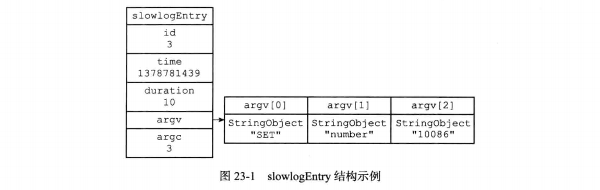
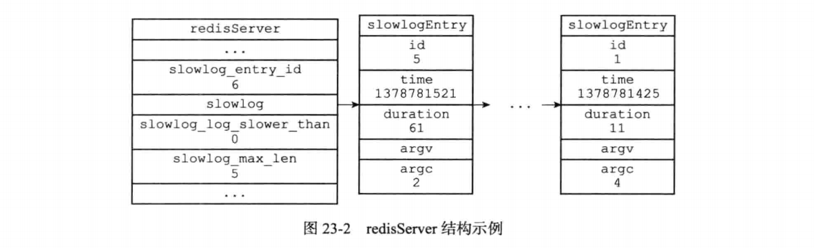

* Redis的慢查询日志功能用于记录执行时间超过给定时长的命令请求，用户可以通过这 个功能产生的日志来监视和优化査询速度。
* 服务器配置有两个和慢査询日志相关的选项:
  * slowlog-log-slower-than选项指定执行时间超过多少微秒(1秒等于1 000 000 微秒)的命令请求会被记录到日志上。举个例子，如果这个选项的值为100,那么执行时间超过100微秒的命令就会被记录 到慢查询日志；如果这个选项的值为500,那么执行时间超过500微秒的命令就会被记录到慢査询日志。
  * slowlog-max-len选项指定服务器最多保存多少条慢査询日志。服务器使用先进先出的方式保存多条慢査询日志，当服务器存储的慢査询日志数量等于 slowlog-max-len选项的值时，服务器在添加一条新的慢查询日志之前，会先将最旧的 一条慢查询日志删除。举个例子，如果服务器slowlog-max-len的值为100,并且假设服务器已经储存了 100条慢查询日志，那么如果服务器打算添加一条新日志的话，它就必须先删除目前保存的 最旧的那条日志，然后再添加新日志。

#### 慢查询记录的保存

* 服务器状态中包含了几个和慢查询日志功能有关的属性:

  ```c
  struct redisServer (
      //・..
      //下一条慢查询日志的ID
      long long slowlog_entry_id;
  
      //保存了所有慢査询日志的链表
      list *slowlog;
  
      //服务器配置slowlog-log-slower-than选项的值
      long long slowlog_log_slower_than;
  
      //服务器配置slowlog-max-len选项的值 
      unsigned long slowlog_max_len;
      // ...
  };
  ```

  slowlog_entry_id属性的初始值为0,每当创建一条新的慢查询日志时，这个属性 的值就会用作新日志的id值，之后程序会对这个属性的值增一。例如，在创建第一条慢查询日志时，slowlog_entry_id 的值。会成为第一条慢查询 日志的ID,而之后服务器会对这个属性的值增一；当服务器再创建新的慢查询日志的时候， slowlog_entry_id的值1就会成为第二条慢查询日志的ID,然后服务器再次对这个属 性的值增一，以此类推。

* slowlog 链表保存了服务器中的所有慢查询日志，链表中的每个节点都保存了一个 slowlogEntry 结构，每个 slowlogEntry 结构代表一条慢査询日志:

  ```c
  typedef struct slowlogEntry {
      //唯一标识符
      long long id;
  
      //命令执行时的时间，格式为UNIX时间戳
      time_t time;
  
      //执行命令消耗的时冋，以微秒为单位
      long long duration;
  
      //命令与命令参数
      robj **argv;
  
      //命令与命令参数的数量
      int argc;
  } slowlogEntry;
  ```

* 举个例子，对于以下慢査询日志来说:

  ```
  1) (integer) 3
  2) (integer) 1378781439
  3) (integer) 10
  4)  1)"SET"
      2) "number"
      3) ”10086”
  ```

  

* 下图展示了服务器状态中和慢査询功能有关的属性:

  

  * slowlog_entry_id的值为6,表示服务器下条慢査询日志的id值将为6。
  * slowlog链表包含了 id为5至1的慢査询日志，最新的5号日志排在链表的表头， 而最旧的1号日志排在链表的表尾，这表明slowlog链表是使用插入到表头的方式来添加新日志的。
  * slowlog_log_slower_than 记录了服务器配置 slowlog-log-slower-than 选项的值0,表示任何执行时间超过0微秒的命令都会被慢查询日志记录。
  * slowlog-max-len属性记录了服务器配置slowlog-max-len选项的值5,表示服务器最多储存五条慢查询日志。

#### 慢查询日志的阅览和删除

* 弄清楚了服务器状态的slowlog链表的作用之后，我们可以用以下伪代码来定义査看 日志的 `SLOWLOG GET` 命令:

  ```
  def SLOWLOG_GET(number=None):
      #用户没有给定number参数
      #那么打印服务器包含的全部慢查询日志
      if number is None:
      number = SLOWLOG_LEN()
      #遍历服务器中的慢查询日志
      for log in redisServer.slowlog:
          if number <= 0:
              #打印的日志数量已经足够，跳出循环
              break
          else:
              #继续打印，将计数器的值减一
              number -= 1
              #打印日志 
              printLog(log)
  ```

* 查看日志数量的 `SLOWLOG LEN` 命令可以用以下伪代码来定义:

  ```
  def SLOWLOG_LEN():
      # slowlog链表的长度就是慢查询日志的条目数量
      return len(redisServer.slowlog)
  ```

* 另外，用于清除所有慢查询日志的`SLOWLOG RESET`命令可以用以下伪代码来定义:

  ```
  def SLOWLOG_RESET():
      #遍历服务器中的所有慢查询日志
      for log in redisServer.slowlog:
          #删除日志
          deleteLog(log)
  ```

#### 添加新日志

* 在每次执行命令的之前和之后，程序都会记录微秒格式的当前UNIX时间戳，这两个时 间戳之间的差就是服务器执行命令所耗费的时长，服务器会将这个时长作为参数之一传给 slowlogPushEntry If Needed 函数，而 slowlogPushEntry If Needed 函数贝 U负责检 查是否需要为这次执行的命令创建慢查询日志，以下伪代码展示了这一过程:

  ```
  #记录执行命令前的时间
  before = unixtime_now_in_us()
  #执行命令
  execute_command(argv, argc, client)
  #记录执行命令后的时间
  after = unixtime_now_in_us()
  #检查是否需要创建新的慢查询日志
  slowlogPushEntryIfNeeded(argv, argc, before-after)
  ```

* slowlogPushEntryIfNeeded 函数的作用有两个:
  1. 检查命令的执行时长是否超过 `slowlog-log-slower-than` 选项所设置的时间， 如果是的话，就为命令创建一个新的日志，并将新日志添加到slowlog链表的表头。
  2. 检査慢査询日志的长度是否超过 `slowlog-max-len` 选项所设置的长度，如果是的话，那么将多出来的日志从slowlog链表中删除掉。

* 以下是slowlogPushEntryIfNeeded函数的实现代码:

  ```c
  void slowlogPushEntrylfNeeded(robj **argv, int argc, long long duration) {
  
      //慢查询功能未开启，直接返回
      if (server.slowlog_log_slower_than < 0) return;
  
      //如果执行时间超过服务器设置的上限，那么将命令添加到慢查询日志
      if (duration >= server.slowlog_log_slower_than)
  
      //新日志添加到链表表头
      listAddNodeHead(server.slowlog,slowlogCreateEntry(argv,argc,duration));
  
      //如果日志数量过多，那么进行删除
      while (listLength(server.slowlog) > server.slowlog_max_len) 
          listDelNode(server.slowlog,listLast(server.slowlog));
  }
  ```

* 函数中的大部分代码我们已经介绍过了，唯一需要说明的是slowlogCreateEntry 函数:该函数根据传入的参数，创建一个新的慢查询日志，并将redisServer.slowlog_entry_id 的值增 1

#### 重点回顾

* Redis的慢查询日志功能用于记录执行时间超过指定时长的命令。
* Redis服务器将所有的慢査询日志保存在服务器状态的slowlog链表中，每个链表 节点都包含一个slowlogEntry结构，每个slowlogEntry结构代表一条慢査询日志
* 打印和删除慢查询日志可以通过遍历slowlog链表来完成。
* slowlog链表的长度就是服务器所保存慢査询日志的数量。
* 新的慢查询日志会被添加到slowlog链表的表头，如果日志的数量超过slowlog- max-len选项的值，那么多出来的日志会被删除。

 

