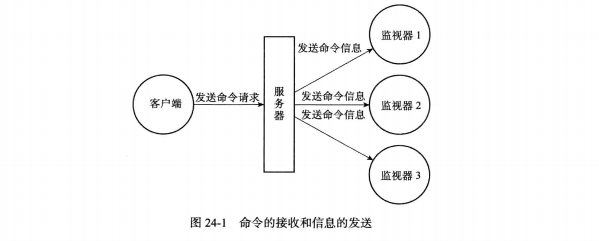
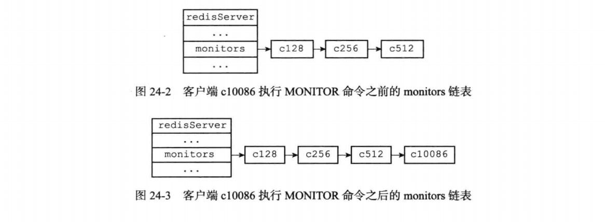
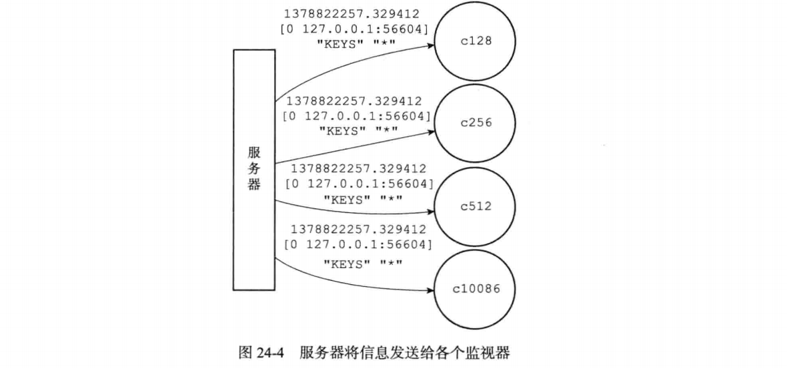

* 通过执行命令，客户端可以将自己变为一个监视器，实时地接收并打印出服务器当前处理的命令请求的相关信息

* 每当一个客户端向服务器发送一条命令请求时，服务器除了会处理这条命令请求之外, 还会将关于这条命令请求的信息发送给所有监视器

  

#### 成为监视器

* 发送 `MONITOR` 命令可以让一个普通客户端变为一个监视器，该命令的实现原理可以用以下伪代码来实现:

  ```
  def MONITOR():
      #打开客户端的监视器标志
      client.flags |= REDIS_MONITOR
      #将客户端添加到服务器状态的monitors链表的末尾 
      server.monitors.append(client)
      #向客户端返回OK 
      send_reply("OK")
  ```

* 举个例子，如果客户端c 10086向服务器发送`MONITOR` 命令，那么这个客户端的 REDIS_MONITOR标志会被打开，并且这个客户端本身会被添加到monitors链表的表尾。假设客户端C10086发送`MONITOR` 命令之前，monitors链表的状态如图24-2所示， 那么在服务器执行客户端C10086发送的MCW7TOR命令之后，monitors链表将被更新 为图24-3所示的状态。

  

#### 向监视器发送命令信息

* 服务器在每次处理命令请求之前，都会调用replicationFeedMonitors函数，由 这个函数将被处理的命令请求的相关信息发送给各个监视器。

* 以下是replicationFeedMonitors函数的伪代码定义，函数首先根据传入的参数 创建信息，然后将信息发送给所有监视器:

  ```
  def replicationFeedMonitors(client, monitors, dbid, argv, argc):
  #根据执行命令的客户端、当前数据库的号码、命令参数、命令参数个数等参数
  #创建要发送给各个监视器的信息
  msg = create_message(client, dbid, argv, argc)
  #遍历所有监视器
  for monitor in monitors:
      #将信息发送给监视器 
      sendmessage(monitor, msg)
  ```

* 举个例子，假设服务器在时间1378822257.329412,根据IP为127.0.0.1、端口 号为56604的客户端发送的命令请求，对0号数据库执行命令KEYS\*,那么服务器将创建 以下信息:`1378822257.329412 [0 127.0.0.1:56604] "KEYS"  "\*"。如果服务器monitors链表的当前状态如图24-3所示，那么服务器会分别将信息发送 给cl28、c256、c512和C10086四个监视器。

  

#### 重点回顾

* 客户端可以通过执行`MONITOR` 命令，将客户端转换成监视器，接收并打印服务器处理的每个命令请求的相关信息。
* 当一个客户端从普通客户端变为监视器时，该客户端的REDIS_MONITOR标识会被打开。
* 服务器将所有监视器都记录在monitors链表中。
* 每次处理命令请求时，服务器都会遍历mointors链表，将相关信息发送给监视器。